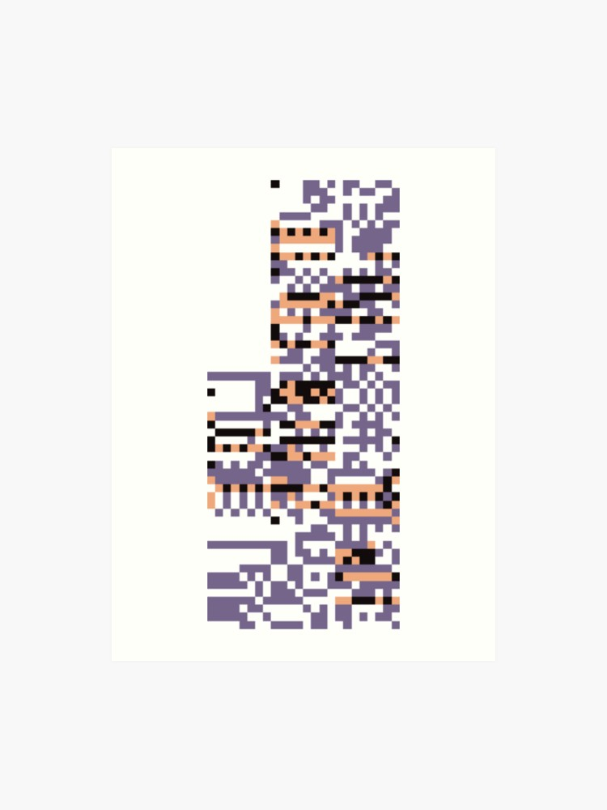

 <section>
        <ul class="grid">
            <li class="pokemon">
                <h3>Name: Missingno</h3>
                
                
Type: Bird

            </li>
            <li class="pokemon">
                <h3>Name: Missingno</h3>
                
                
Type: Bird

            </li>
            <li class="pokemon">
                <h3>Name: Missingno</h3>
                
                
Type: Bird

            </li>
            <li class="pokemon">
                <h3>Name: Missingno</h3>
                
                
Type: Bird

            </li>        
            <li class="pokemon">
                <h3>Name: Missingno</h3>
                
                
Type: Bird

            </li>
            <li class="pokemon">
                <h3>Name: Missingno</h3>
                
                
Type: Bird

            </li>
            <li class="pokemon">
                <h3>Name: Missingno</h3>
                
                
Type: Bird

            </li>
            <li class="pokemon">
                <h3>Name: Missingno</h3>
                
                
Type: Bird

            </li>
            <li class="pokemon">
                <h3>Name: Missingno</h3>
                
                
Type: Bird

            </li>
            <li class="pokemon">
                <h3>Name: Missingno</h3>
                
                
Type: Bird

            </li>
            <li class="pokemon">
                 <h3>Name: Missingno</h3>
                
                
Type: Bird

            </li>
            <li class="pokemon">
                <h3>Name: Missingno</h3>
                
                
Type: Bird

            </li>
            <li class="pokemon">
                 <h3>Name: Missingno</h3>
                
                
Type: Bird

            </li>
            <li class="pokemon">
                <h3>Name: Missingno</h3>
                
                
Type: Bird

            </li>
            <li class="pokemon">
                <h3>Name: Missingno</h3>
                
                
Type: Bird

           </li>
           <li class="pokemon">
                <h3>Name: Missingno</h3>
                
                
Type: Bird

            </li>
            <li class="pokemon">
                <h3>Name: Missingno</h3>
                
                  
Type: Bird

            </li>
            <li class="pokemon">
              <h3>Name: Missingno</h3>
              
              
Type: Bird

            </li>
            <li class="pokemon">
                <h3>Name: Missingno</h3>
                
                
Type: Bird

            </li>
            <li class="pokemon">
                 <h3>Name: Missingno</h3>
                
                
Type: Bird

            </li>
            <li class="pokemon">
                <h3>Name: Missingno</h3>
                
                 
Type: Bird

            </li>
            <li class="pokemon">
                <h3>Name: Missingno</h3>
                
                
Type: Bird

            </li>
            <li class="pokemon">
                <h3>Name: Missingno</h3>
                
                
Type: Bird

            </li>
            <li class="pokemon">
                <h3>Name: Missingno</h3>
                
                
Type: Bird

            </li>
            <li class="pokemon">
                <h3>Name: Missingno</h3>
                
                
Type: Bird

            </li>
        </ul>
    </section>